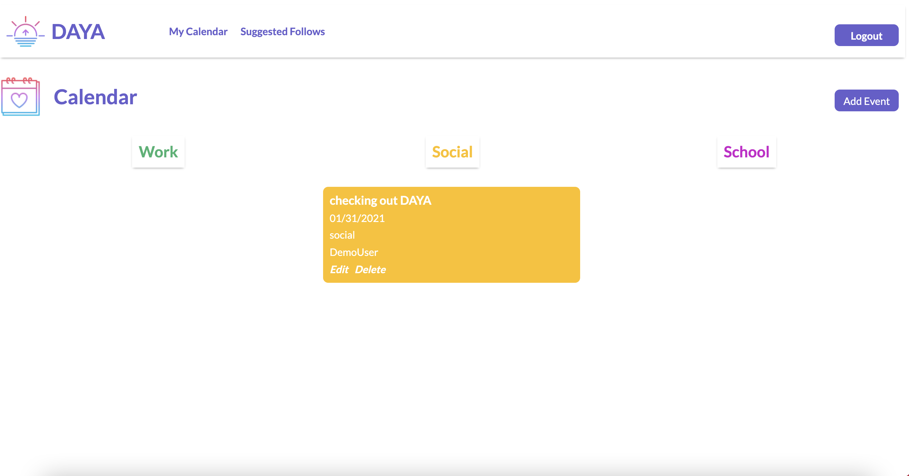
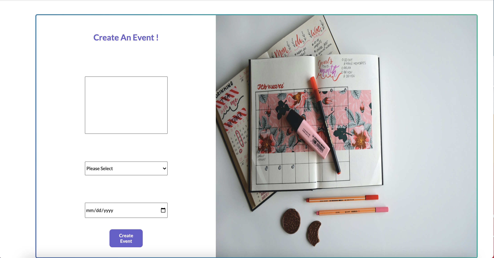

## DAYA 

DAYA is a social planner. Inspired by the desire to stay up to date on your friends calendars, DAYA allows for users to create, edit, or delete their own events, follow their friends events and view friends calendars.

Live Site: [DAYA](http://daya-mern.herokuapp.com/#/)


## Technologies Used 
* MongoDB
* Express
* React
* Redux
* Node

### Sign In/Sign Up
 * Users are able to sign in to an existing acctount, create a new account, or use demo user log in feature


### EventIndexItem

The below EventIndexItem is dynamically employed everywhere across the application that event data is rendered in combination with varying logic based on its intended function (e.g. newfeeds, user calendar, etc.) 

```javascript

class EventIndexItem extends React.Component {

  render() {
    const { _id, title, category, date, username } = this.props.event;
    const { currentUser } = this.props;

    const newDate = () => {

    const newDate = date.split("T")[0].split("-")
    return `${newDate[1]}/${newDate[2]}/${newDate[0]}`;
    };

    if (!this.props.event) {
      return null;
    } else {
      return (
        <Link id="event-link" to={`/calendar/${username}`}>

        <div className="event" id={category}>
          <h3 className="event-card" id="event-header">{title}</h3>
          <div className="event-card">{newDate()}</div>
          <div className="event-card">{category}</div>
            <div className="event-card">{username}</div>
          {username === currentUser.username ? (
            <div id="event-buttons">
              
              <Link id="event-edit"to={"/editEvent/" + _id}>Edit </Link>
              <button type="button" id="event-delete" onClick={() => this.props.delete(_id)}>Delete </button>
            </div>
          ) : null}
        </div>
        </Link>
      );
    }
  }
}

```


### Newsfeed 
* View your friends events sorted by most recent upcoming event


### Follow/Unfollow 
* Ability fo follow and unfollow other DAYA users 
* Custom association on Mongoose Model 


```
UserSchema.methods.follow = function(id) {
  if(this.following.indexOf(id) === -1){
    this.following.push(id)
  }
  return this.save();
}
```
* Express post request
```
router.post('/:username/follow', passport.authenticate('jwt', {session: false}), (req, res) => {
  let currentUser = req.user
  User.findOne({ username: req.params.username })
    .then((user) => currentUser.follow(user.id))
    .then((user) => res.json({
                          id: user.id,
                          username: user.username,
                          following: user.following,
                        }))
})
```


### Personal Calendar 
* Personal events 
* Ability to edit, delete or create events 



### Event CRUD 
* If logged in, ability to add, edit or delete personal events 




### Suggested Follows 
* List of all users on DAYA, including how many people they follow and how 
many events they have 


